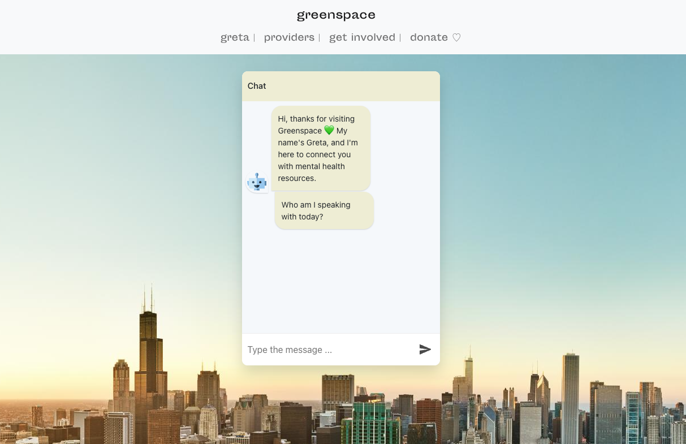
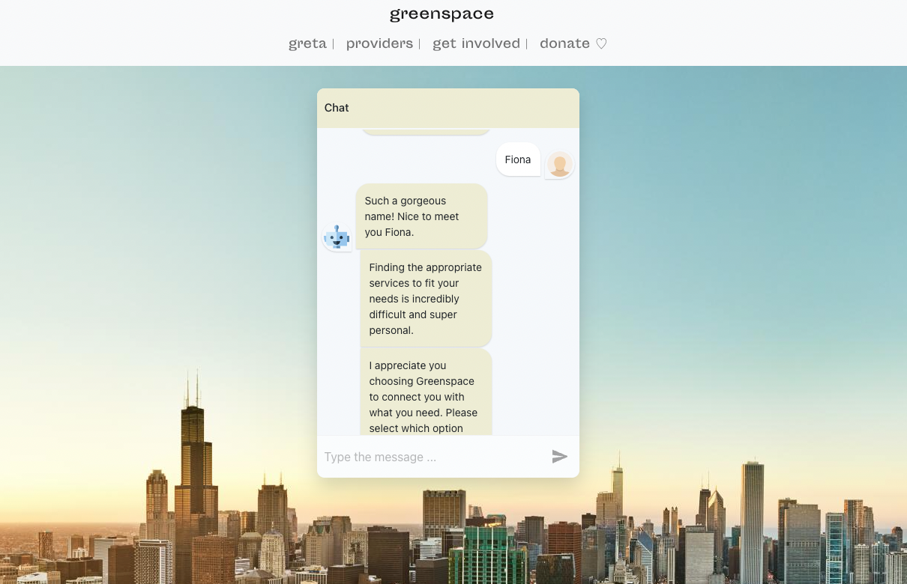
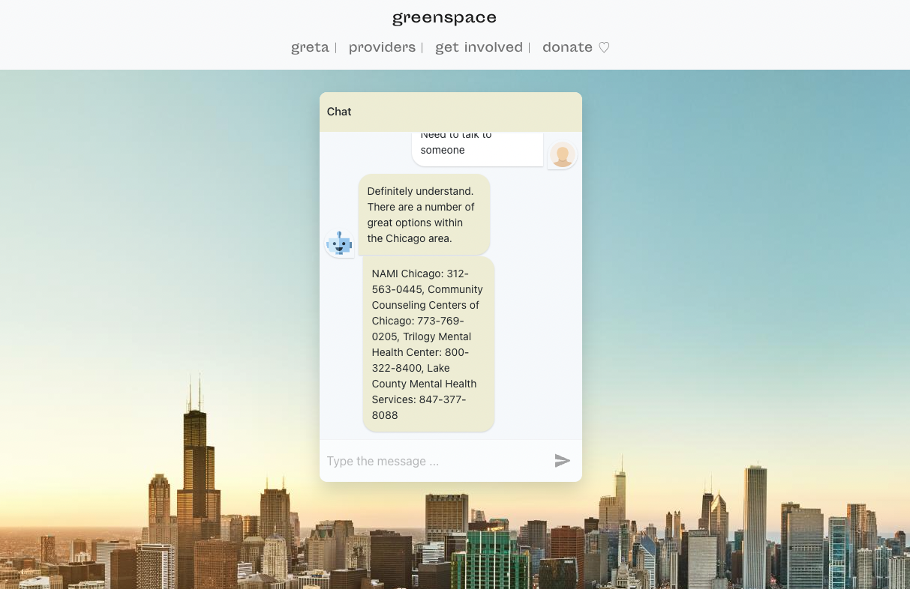
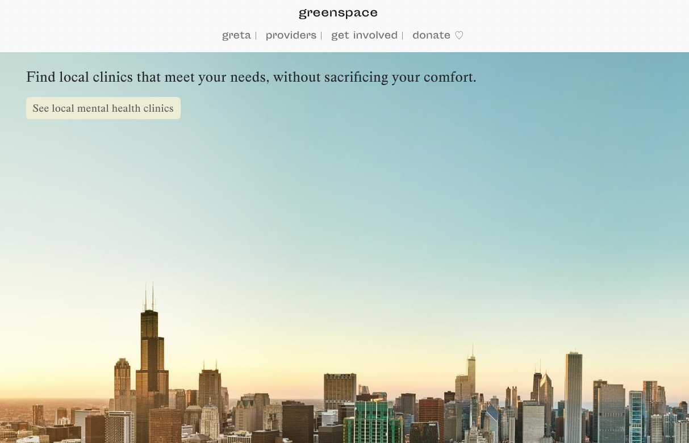
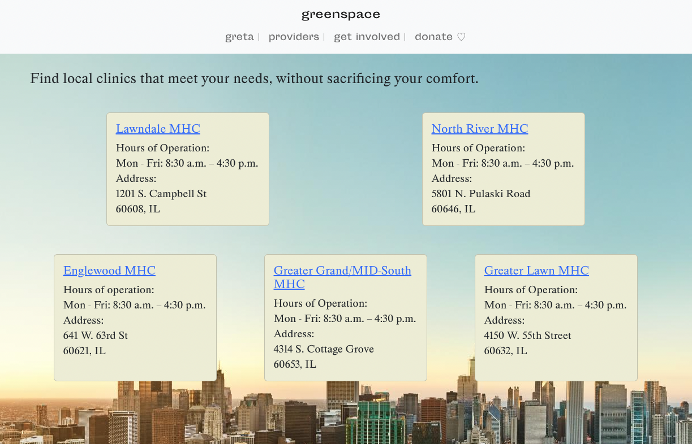
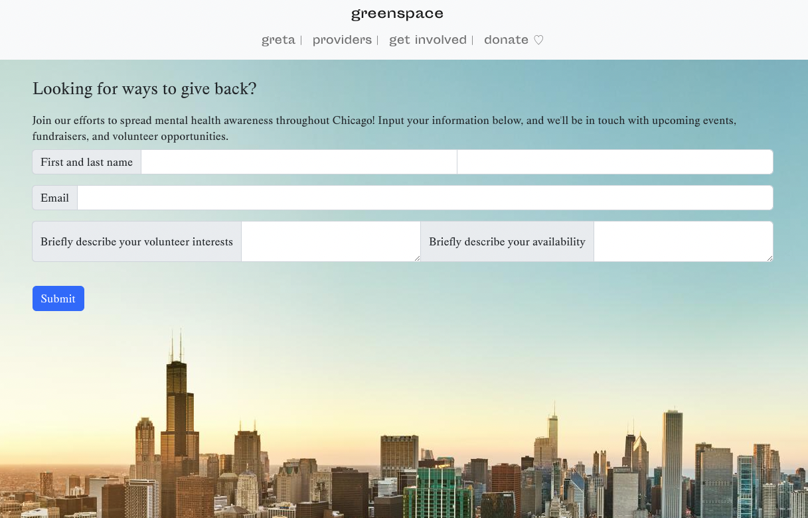
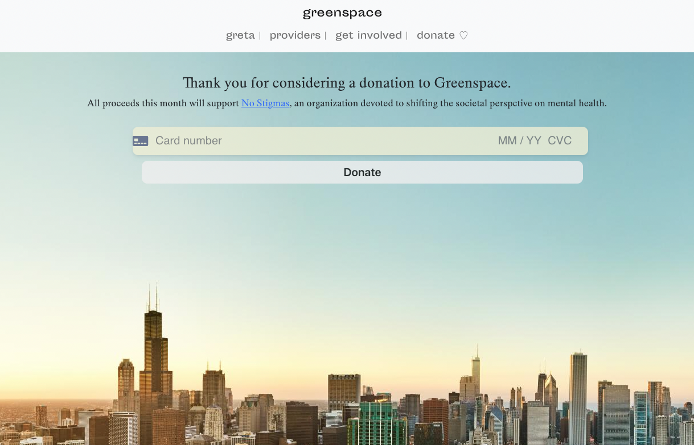

# Greenspace

Greenspace connects Chicago residents to mental health clinics and resources. The application aims to lessen the barriers to accessing quality mental healthcare, all while lifting up the providers on the front-line.

## Tech Stack

**Client:** React, Redux

**Server:** Node, Express, Stripe

**Deployment:** Netlify

**Design:** Boostrap, CSS

**API:** City of Chicago Data Portal

## Features

- Full-scale chatbot through which users can interact, receive resources, and connect with providers.
- Local mental health clinic information rendered through City of Chicago Data API call.
- Redux-managed sign up page, through which users can subscribe to updates, events, and volunteer opportunities with Greenspace.
- Stripe-operated donation hub where visitor can contribute funds to the organization of the month.

## Screenshots

## Developer Team
- [Fiona Eckert](https://www.linkedin.com/in/fiona-eckert/)

## Github Repo
[Greenspace repo](https://github.com/fionaeckert/react_project)
